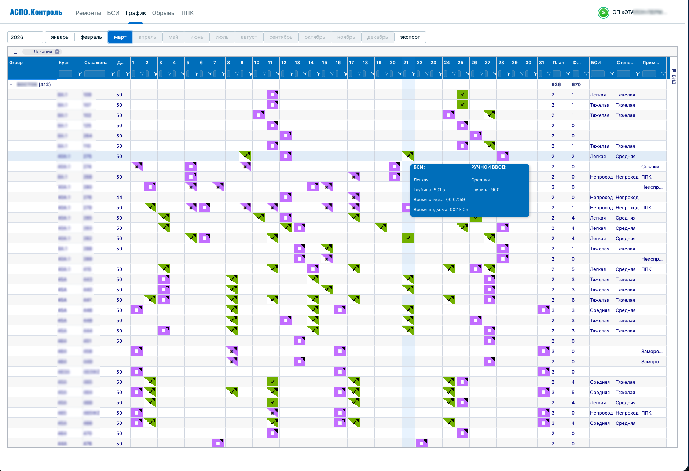
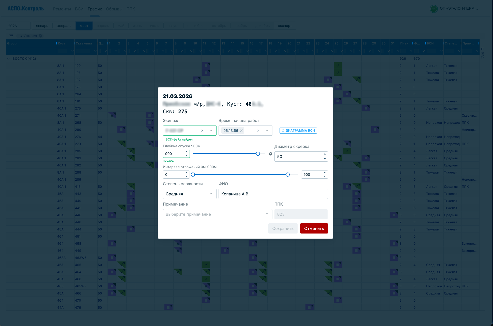
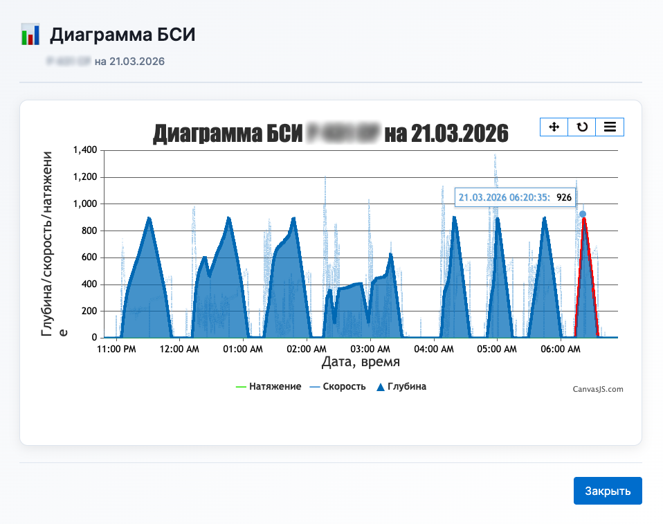
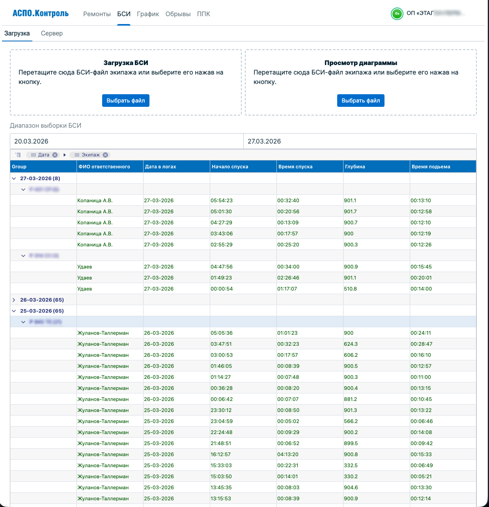

# ASPO Monitoring / АСПО.Контроль

🇷🇺 Русский

> Система мониторинга и оптимизации операций по скребкованию скважин на основе фактических данных

## Обзор

Система анализирует данные из электронных систем контроля (ЭСК), определяет характер и степень отложений и помогает оптимизировать планирование работ — заменяя зависимость от отчётов подрядчиков объективными данными.

## Проблема → Решение

| Проблема | Решение |
|---|---|
| Нет достоверных данных по отложениям | Импорт и автоматический анализ данных ЭСК |
| Зависимость от отчётов подрядчиков | Независимая верификация данных системой |
| Лишние обработки скважин | Классификация скважин по фактическому состоянию |
| Высокие затраты и неэффективность | Data-driven планирование операций |

## Возможности

- **Импорт и обработка** данных из ЭСК
- **Автоматическая классификация** скважин по степени отложений
- **Интерактивные дашборды** — графики, таблицы, диаграммы
- **Формирование отчётов** и рассылка
- **Верификация** данных подрядчиков
- **Экспорт в Excel**

## Стек

| Слой | Технологии |
|---|---|
| Backend | Python, Django DRF, Dramatiq |
| Frontend | React, TypeScript |
| Database | PostgreSQL, Redis |

## Результат

- Сокращение излишних обработок скважин
- Повышение точности данных и планирования
- Снижение трудозатрат и операционных расходов
- Независимый контроль качества работ подрядчиков

## Скриншоты

  
  

  
  

---

*Проект представлен в обобщённом виде без раскрытия конфиденциального внутреннего содержимого.*

---

🇬🇧 English

> Well scraping operations monitoring and optimization system based on real operational data

## Overview

The system analyzes data from electronic control systems (ESC), evaluates deposit characteristics and severity, and helps optimize maintenance planning — replacing dependence on contractor reports with objective data.

## Problem → Solution

| Problem | Solution |
|---|---|
| No reliable deposit condition data | Automated import and analysis of ESC data |
| Dependence on contractor-reported info | Independent system-level data verification |
| Unnecessary well treatments | Well classification by actual condition |
| High costs and inefficiencies | Data-driven operation planning |

## Features

- **Data import and processing** from ESC systems
- **Automated classification** of wells by deposit severity
- **Interactive dashboards** — charts, tables, diagrams
- **Report generation** and distribution
- **Contractor data verification**
- **Excel export**

## Tech Stack

| Layer | Technologies |
|---|---|
| Backend | Python, Django DRF, Dramatiq |
| Frontend | React, TypeScript |
| Database | PostgreSQL, Redis |

## Impact

- Reduction of unnecessary well treatments
- Improved data accuracy and planning quality
- Lower operational costs and manual workload
- Independent quality control of contractor operations

## Screenshots

  
  

  
  

---

*This project is presented in a generalized form without disclosing confidential internal content.*

