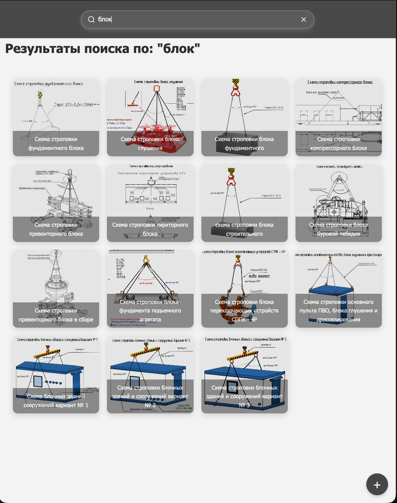
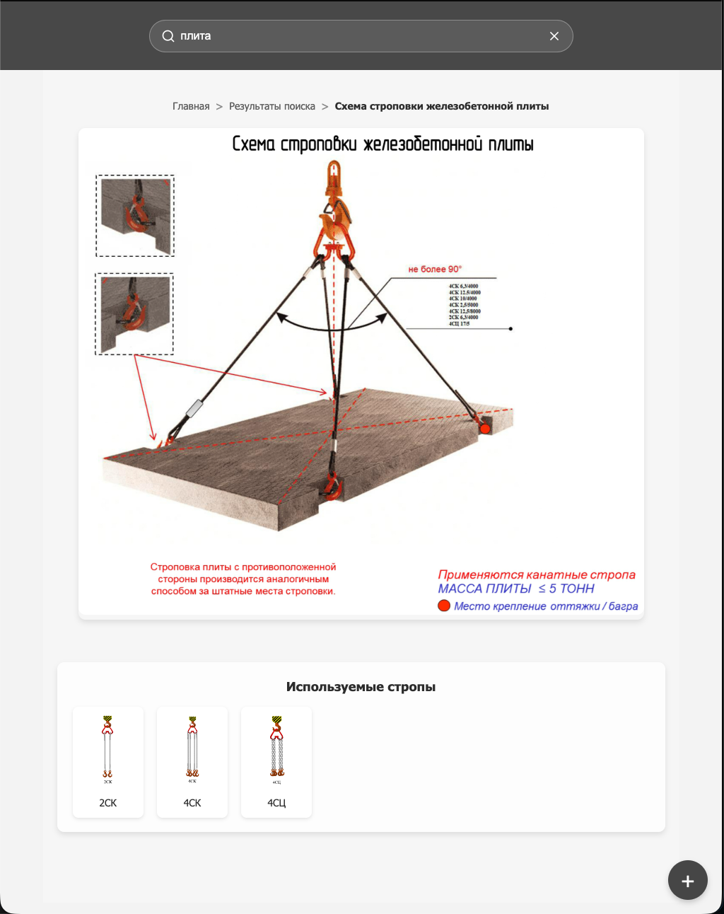

# ГрузМастер

> Веб-платформа для поиска, просмотра и управления схемами строповки с мобильным доступом и семантическим поиском

---

🇷🇺 Русский

### 🚀 Обзор

ГрузМастер — это цифровая платформа для хранения, поиска и управления схемами строповки, используемыми при погрузочно-разгрузочных работах.

Сервис заменяет бумажные альбомы и предоставляет быстрый доступ к схемам с мобильных устройств (смартфоны, планшеты), повышая удобство и безопасность работы.

---

### 💡 Проблема

- сложно быстро найти нужную схему строповки  
- бумажные альбомы неудобны в полевых условиях  
- документация может быть устаревшей или недоступной  
- ошибки при выборе схем увеличивают операционные риски  

---

### ✅ Решение

Централизованная цифровая база схем строповки с:

- быстрым поиском (текстовым и семантическим)  
- структурой по категориям и подкатегориям  
- мобильным доступом через QR-коды  
- детальными карточками схем с визуализацией  
- удобным добавлением и обновлением контента  

---

### 🧩 Возможности

- каталог схем строповки с поиском  
- семантический и полнотекстовый поиск  
- навигация по категориям  
- детальная карточка схемы  
- адаптивный интерфейс (mobile-first)  
- административная панель для управления контентом  
- доступ по QR-кодам на объекте  

---

### ⚙️ Технологии

**Frontend:**  
React, TypeScript, styled-components, TanStack Query  

**Backend:**  
Django DRF  

**Поиск / данные:**  
Elasticsearch  

**Инфраструктура:**  
Docker, Nginx  

---

### Результат

- сокращение времени поиска схем  
- повышение доступности производственных знаний  
- отказ от бумажной документации  
- стандартизация выполнения работ  
- повышение безопасности грузоподъемных операций  

---

### Скриншоты

  
  

  Нажми на изображение, чтобы открыть в полном размере

---

### Примечание

Проект представлен в обобщенном виде без раскрытия конфиденциального внутреннего содержимого.

---

🇬🇧 English

### 🚀 Overview

CargoMaster is a digital platform for storing, searching, and managing cargo slinging schemes used in loading and unloading operations.

The system replaces paper-based manuals and provides fast access to required schemes from mobile devices, improving usability and operational safety.

---

### 💡 Problem

- difficulty in quickly finding the correct slinging scheme  
- paper-based documentation is inconvenient in field conditions  
- documentation may be outdated or unavailable  
- incorrect scheme selection increases operational risks  

---

### ✅ Solution

A centralized digital system providing:

- fast keyword and semantic search  
- structured categories and navigation  
- mobile access via QR codes  
- detailed scheme pages with visuals  
- easy content management and updates  

---

### 🧩 Key Features

- searchable catalog of schemes  
- semantic and full-text search  
- category-based navigation  
- detailed scheme view  
- mobile-friendly interface  
- admin panel for content management  
- QR-based access in the field  

---

### ⚙️ Tech Stack

**Frontend:**  
React, TypeScript, styled-components, TanStack Query  

**Backend:**  
Django DRF  

**Search / Data:**  
Elasticsearch  

**Infrastructure:**  
Docker, Nginx  

---

### Value

- reduced time to find required schemes  
- improved accessibility of operational knowledge  
- elimination of paper-based documentation  
- more consistent execution of operations  
- increased safety in lifting processes  

---

### Screenshots

  
  

  Click any image to open it in full size

---

### Notes

This project is presented in a generalized form without disclosing confidential internal content.

