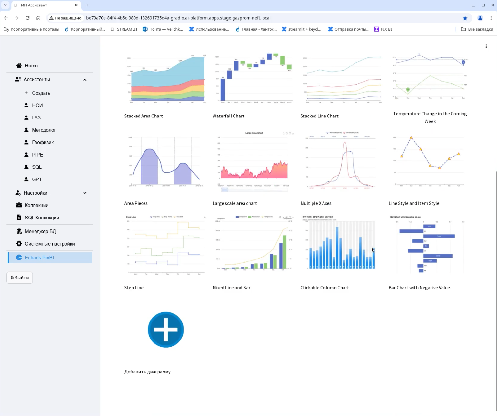

# Digital AI Assistant / Цифровой помощник

<details open>
<summary>🇷🇺 Русский</summary>

> Production-ready AI система для автоматизации рабочих процессов с использованием LLM и мультиагентной архитектуры

## Обзор

Платформа для автоматизации работы с документами, таблицами и базами данных через естественный язык.

Система объединяет LLM, RAG и мультиагентную архитектуру, позволяя пользователям взаимодействовать с данными без необходимости писать код или SQL.

## Проблема → Решение

| Проблема | Решение |
|---|---|
| Работа с данными требует технических навыков | Запросы на естественном языке |
| Ручной анализ документов занимает много времени | RAG-пайплайн с автоматической обработкой |
| Сложно получить ответы из разрозненных источников | Мультиагентная агрегация данных |
| Высокий порог входа для бизнес-пользователей | Интуитивный чат-интерфейс |

## Возможности

- **RAG** — работа с документами (PDF, Excel, текст)
- **Text-to-SQL** — генерация SQL-запросов из естественного языка
- **Суммаризация и анализ** данных
- **Мульти-источники** — агрегация из разных систем
- **Визуализация** — построение графиков и дашбордов
- **Персональные ассистенты** под конкретные задачи

## Архитектура

```
Пользователь
    ↓
Оркестратор
    ├── Classifier Agent     — определение типа запроса
    ├── Query Refiner        — нормализация запроса
    ├── RAG Agent            — работа с документами
    ├── SQL Generator        — генерация SQL
    ├── Debugger             — исправление ошибок
    ├── Chart Agent          — построение графиков
    ├── ECharts Agent        — визуализация
    └── Security Agent       — проверка безопасности
    ↓
Ответ пользователю
```

## Стек

| Слой | Технологии |
|---|---|
| Backend / Core | Python (async processing, pipelines) |
| AI / LLM | LangChain, RAG, Embeddings |
| Data Processing | Pandas, SQL |
| Vector Storage | ChromaDB |
| Interface | Streamlit |

## Результат

- Снижение ручного труда при работе с данными
- Ускорение аналитики и принятия решений
- Доступность данных для нетехнических пользователей

## Демо

[](https://www.youtube.com/watch?v=o1llLmzHkks)

> Нажми на изображение, чтобы посмотреть демо

---

*Проект представлен в обобщённом виде без раскрытия конфиденциального внутреннего содержимого.*

</details>

---

<details>
<summary>🇬🇧 English</summary>

> Production-ready AI system for workflow automation using LLM and multi-agent architecture

## Overview

A platform for automating knowledge work across documents, tables, and databases using natural language.

It combines LLMs, RAG, and a multi-agent architecture to enable users to interact with data without writing code or SQL.

## Problem → Solution

| Problem | Solution |
|---|---|
| Data work requires technical expertise | Natural language queries |
| Manual document analysis is time-consuming | RAG pipeline with automated processing |
| Hard to extract insights from multiple sources | Multi-agent data aggregation |
| High entry barrier for non-technical users | Intuitive chat interface |

## Capabilities

- **RAG** — document understanding (PDF, Excel, text)
- **Text-to-SQL** — natural language to SQL generation
- **Summarization and analysis**
- **Multi-source** — aggregate data from various systems
- **Visualization** — charts and dashboards
- **Personalized assistants** per use case

## Architecture

```
User
  ↓
Orchestrator
  ├── Classifier Agent     — request classification
  ├── Query Refiner        — query normalization
  ├── RAG Agent            — document-based reasoning
  ├── SQL Generator        — NL → SQL
  ├── Debugger             — error correction
  ├── Chart Agent          — visualization
  ├── ECharts Agent        — dashboards
  └── Security Agent       — validation
  ↓
Response
```

## Tech Stack

| Layer | Technologies |
|---|---|
| Backend / Core | Python (async processing, pipelines) |
| AI / LLM | LangChain, RAG, Embeddings |
| Data Processing | Pandas, SQL |
| Vector Storage | ChromaDB |
| Interface | Streamlit |

## Impact

- Reduced manual work in data operations
- Faster analytics and decision-making
- Data accessibility for non-technical users

## Demo

[](https://www.youtube.com/watch?v=o1llLmzHkks)

> Click the image to watch the demo

---

*This project is presented in a generalized form without disclosing confidential internal content.*

</details>