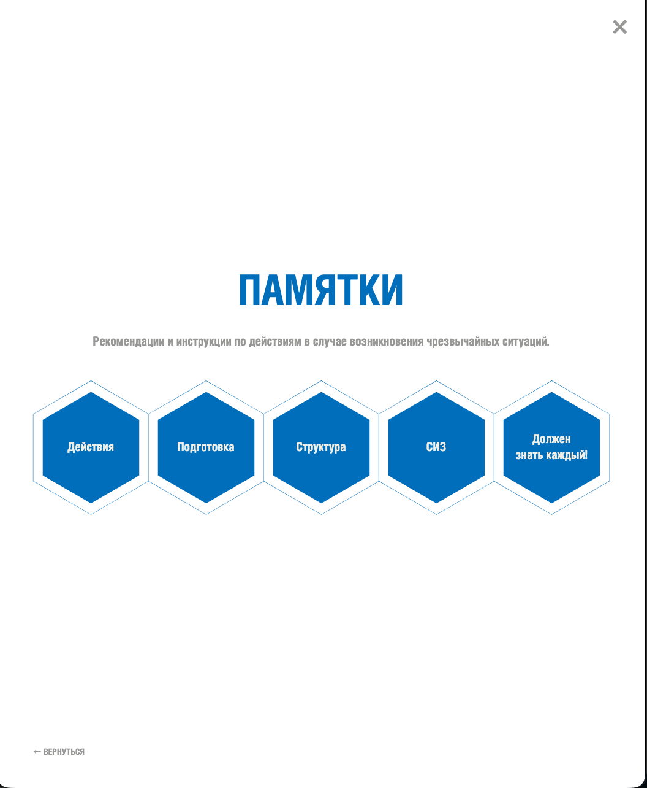
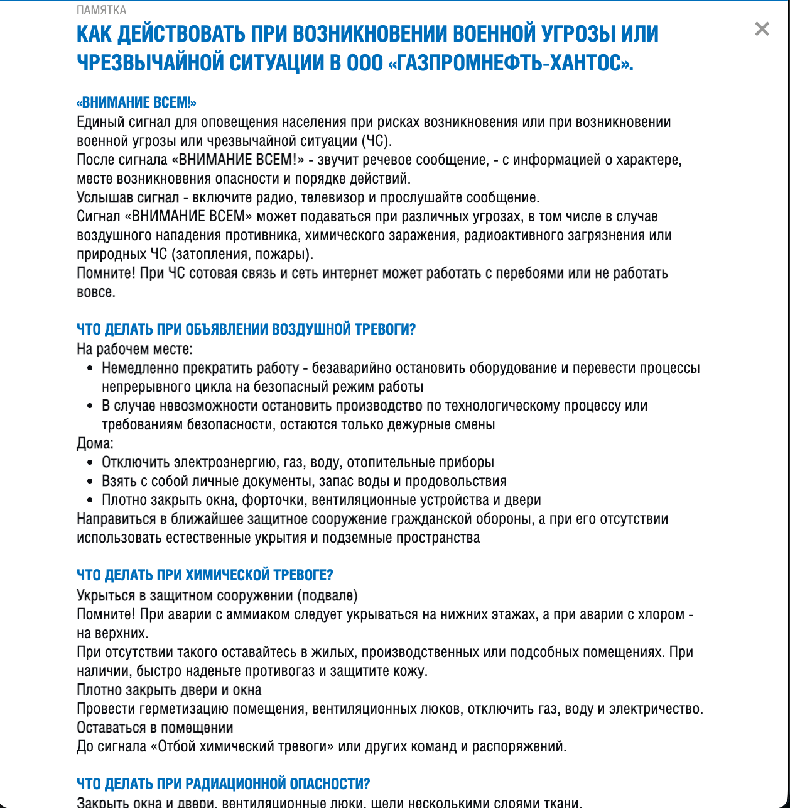

# Emergency QR System / Цифровой стенд ГОиЧС

🇷🇺 Русский

> QR-система для быстрого доступа к инструкциям по действиям в чрезвычайных ситуациях

## Обзор

Система предоставляет сотрудникам и подрядчикам мгновенный доступ к инструкциям по ЧС через QR-коды, размещённые на объектах. Заменяет бумажные стенды централизованной, всегда актуальной веб-базой знаний.

## Проблема → Решение

| Проблема | Решение |
|---|---|
| Нет быстрого доступа к инструкциям | QR-код → мгновенный переход на мобильный интерфейс |
| Зависимость от бумажных материалов | Централизованный веб-контент без печати |
| Устаревшие данные | Обновление в одном месте — актуально везде |
| Затраты на печать и обслуживание | Цифровой формат без расходных материалов |

## Возможности

- **Мгновенный доступ по QR** с любого мобильного устройства
- **Структурированная база знаний** по видам ЧС
- **Централизованное управление** контентом
- **Mobile-first** интерфейс
- **Масштабируемость** на любое число объектов

## Стек

| Слой | Технологии |
|---|---|
| Frontend | HTML, CSS, JavaScript |
| Infrastructure | QR Codes, Web Hosting |

## Результат

- Повышение уровня готовности к ЧС
- Ускорение доступа к инструкциям
- Снижение затрат на поддержание актуальности
- Отказ от бумажных материалов

## Скриншоты

  
  

  

---

*Проект представлен в обобщённом виде без раскрытия конфиденциального внутреннего содержимого.*

---

🇬🇧 English

> QR-based system for instant access to emergency response instructions

## Overview

The system gives employees and contractors immediate access to emergency instructions via QR codes placed on-site. Replaces paper boards with a centralized, always up-to-date web knowledge base.

## Problem → Solution

| Problem | Solution |
|---|---|
| No fast access to emergency instructions | QR code → instant mobile web interface |
| Reliance on printed materials | Centralized web content, no printing required |
| Outdated information | Update once — current everywhere |
| High print and maintenance costs | Digital format with zero consumables |

## Features

- **Instant QR access** from any mobile device
- **Structured knowledge base** by emergency type
- **Centralized content management**
- **Mobile-first** interface
- **Scalable** across any number of sites

## Tech Stack

| Layer | Technologies |
|---|---|
| Frontend | HTML, CSS, JavaScript |
| Infrastructure | QR Codes, Web Hosting |

## Impact

- Improved emergency preparedness
- Faster access to critical instructions
- Reduced content maintenance costs
- Fully paperless format

## Screenshots

  
  

  

---

*This project is presented in a generalized form without disclosing confidential internal content.*

