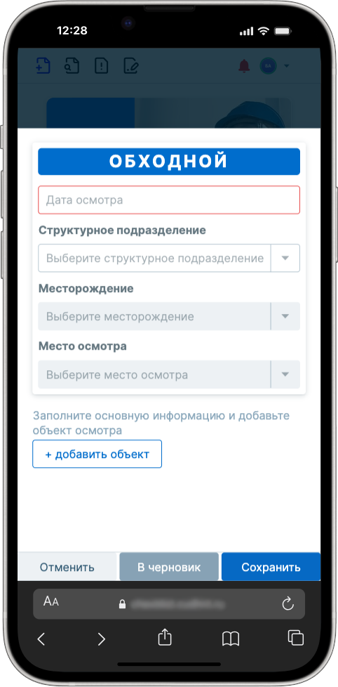
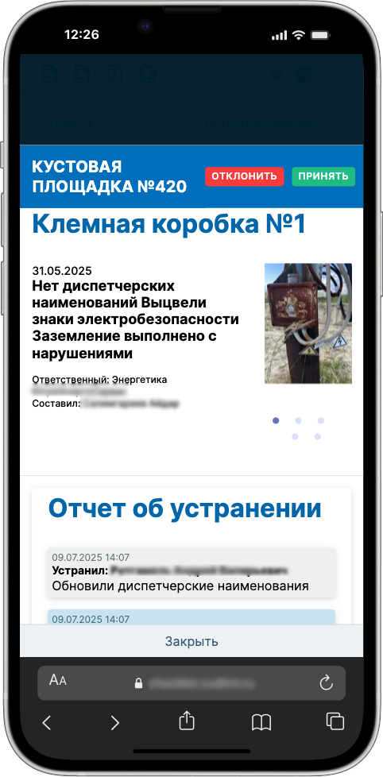
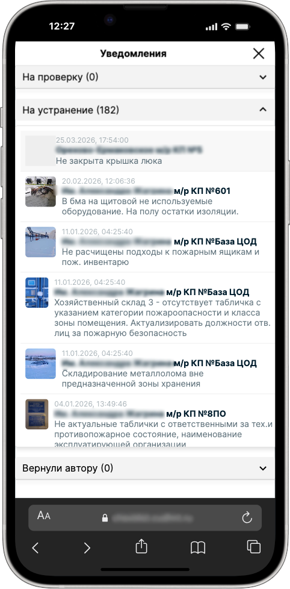
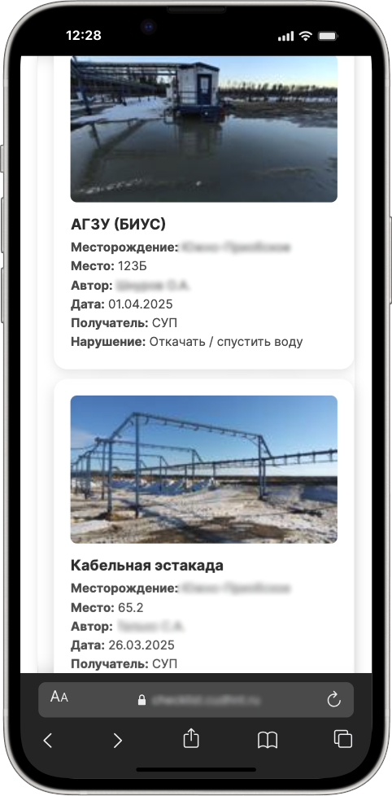

# Сервис+

> Система контроля качества выполнения услуг подрядчиками и управления инспекциями

---

🇷🇺 Русский

### 🚀 Обзор

Service+ — это система для контроля качества выполнения услуг подрядными организациями на производственных объектах.

Платформа цифровизирует инспекции, фиксирует нарушения и управляет полным жизненным циклом их устранения — от выявления
до закрытия.

---

### 💡 Проблема

- отсутствие централизованного контроля подрядчиков
- большое количество объектов и услуг
- повторяющиеся нарушения
- ручные процессы отчетности
- низкая прозрачность процессов

---

### ✅ Решение

Единая система контроля с:

- цифровыми обходными листами
- фиксацией нарушений (с фото)
- назначением ответственных
- отслеживанием статусов
- отчетностью и аналитикой
- экспортом данных (Excel)

---

### 🧩 Возможности

- цифровой чек-лист инспекций
- фиксация нарушений и вложений
- управление жизненным циклом задач
- уведомления и статусы
- отчеты и аналитика
- история изменений (audit trail)

---

### ⚙️ Технологии

**Backend:**  
Python, Django DRF

**Frontend:**  
React, TypeScript, Redux

**Данные:**  
PostgreSQL

---

### Результат

- повышение контроля качества услуг
- снижение повторяющихся нарушений
- ускорение устранения проблем
- повышение прозрачности процессов
- улучшение безопасности

---

### Скриншоты

  
  

  
  

  Нажми на изображение, чтобы открыть в полном размере

---

### Примечание

Проект представлен в обобщенном виде без раскрытия конфиденциального внутреннего содержимого.

---

🇬🇧 English

### 🚀 Overview

Service+ is a system designed to control the quality of services provided by contractors across industrial sites.

It digitizes inspection workflows, tracks violations, and manages the full lifecycle of issue resolution — from
detection to closure.

---

### 💡 Problem

- lack of centralized contractor control
- large number of sites and services
- recurring violations
- manual reporting processes
- low transparency

---

### ✅ Solution

A unified inspection platform with:

- digital inspection checklists
- photo-based issue capture
- task assignment
- status tracking and workflows
- reporting and analytics
- Excel export

---

### 🧩 Key Features

- field-ready inspection forms
- violation tracking workflow
- attachments and photo evidence
- notifications and status updates
- reporting and analytics
- audit trail

---

### ⚙️ Tech Stack

**Backend:**  
Python, Django DRF

**Frontend:**  
React, TypeScript, Redux

**Database:**  
PostgreSQL

---

### Impact

- improved service quality control
- reduced recurring violations
- faster issue resolution
- increased transparency
- improved safety and compliance

---

### Screenshots

  
  

  
  

  Click any image to open it in full size

---

### Notes

This project is presented in a generalized form without disclosing confidential internal content.

