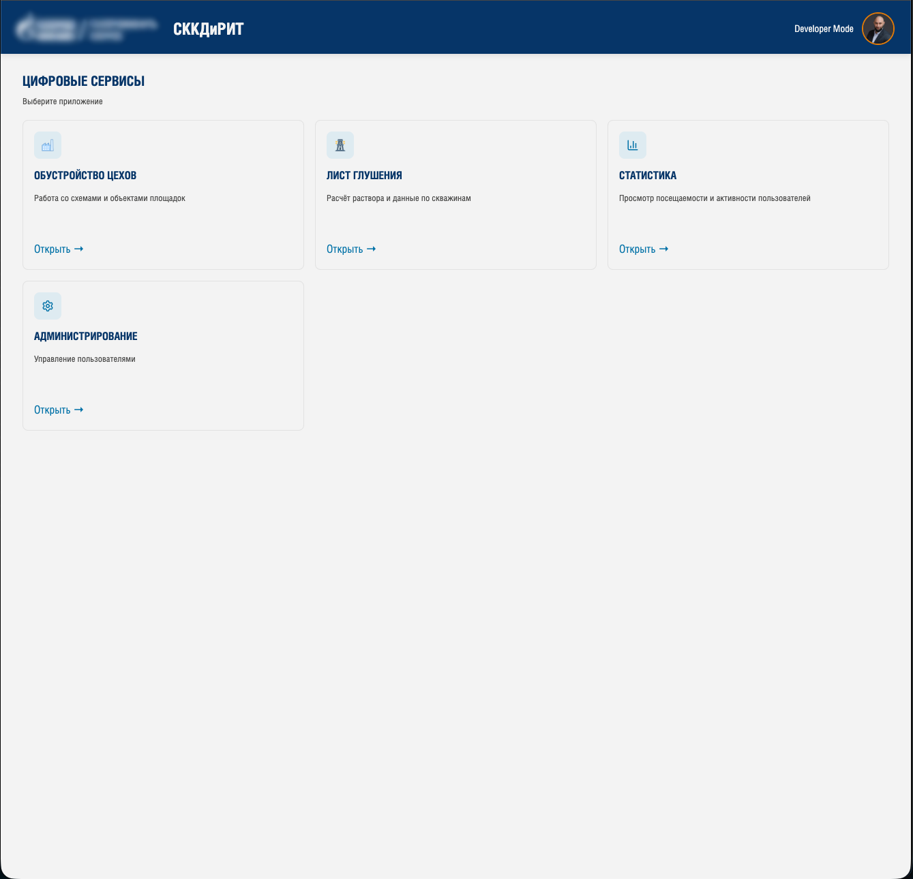
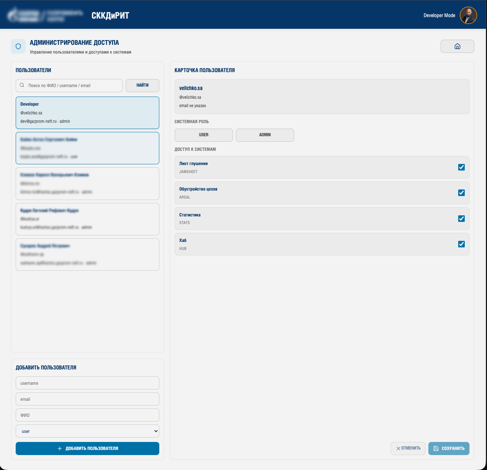
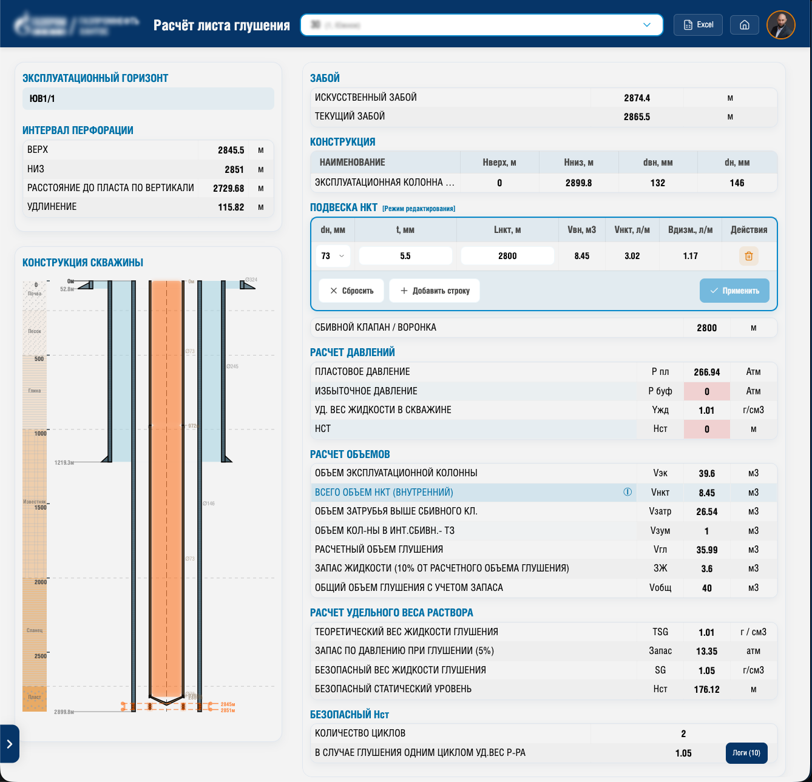
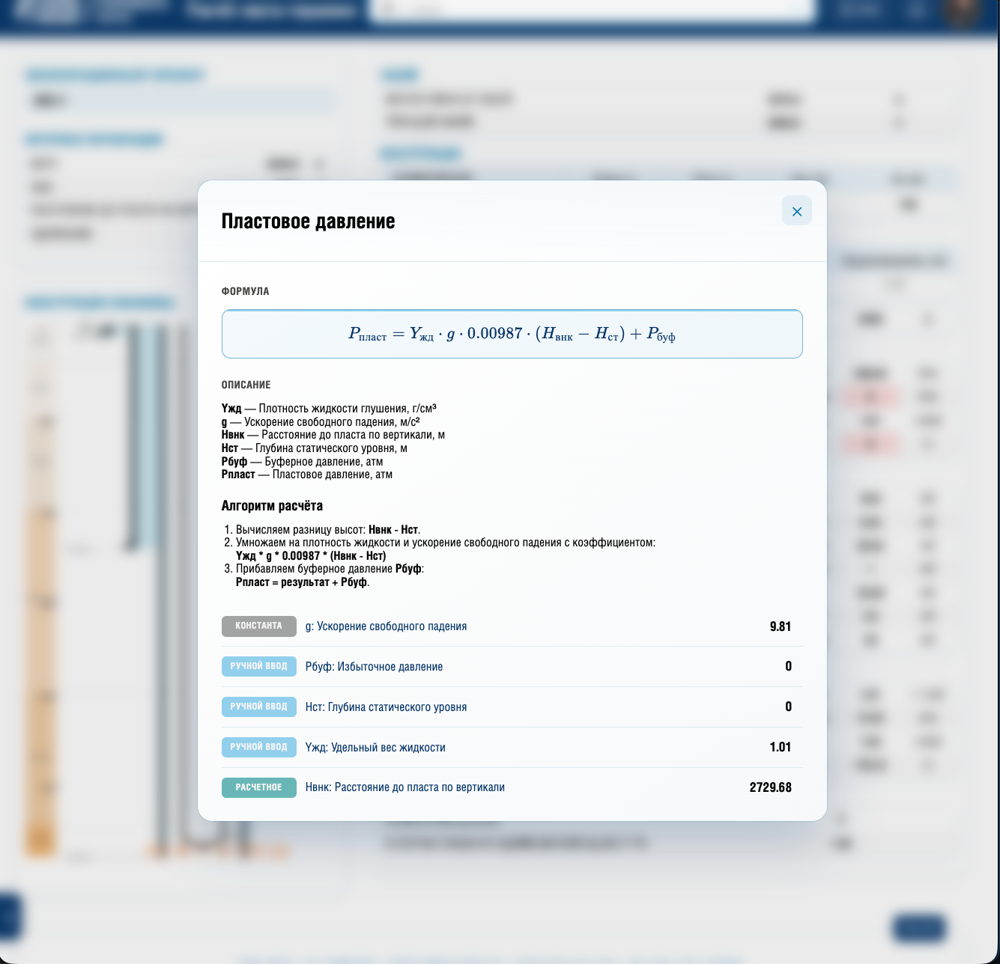
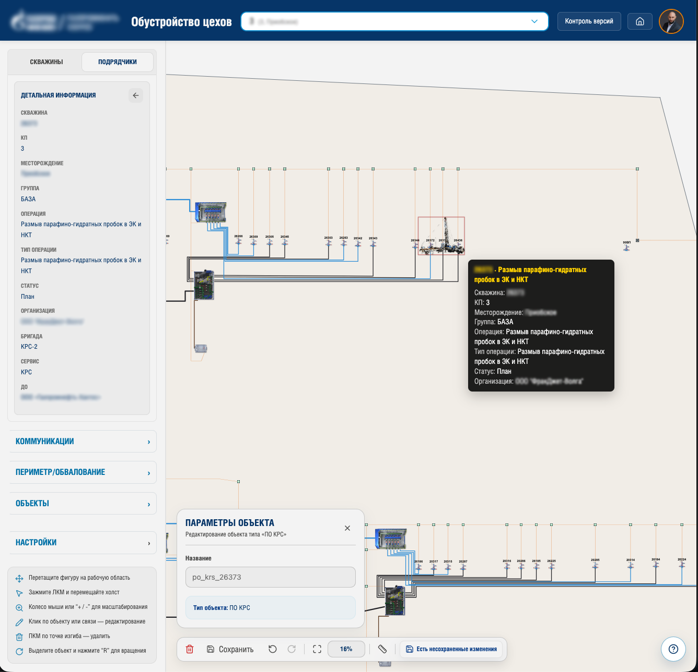
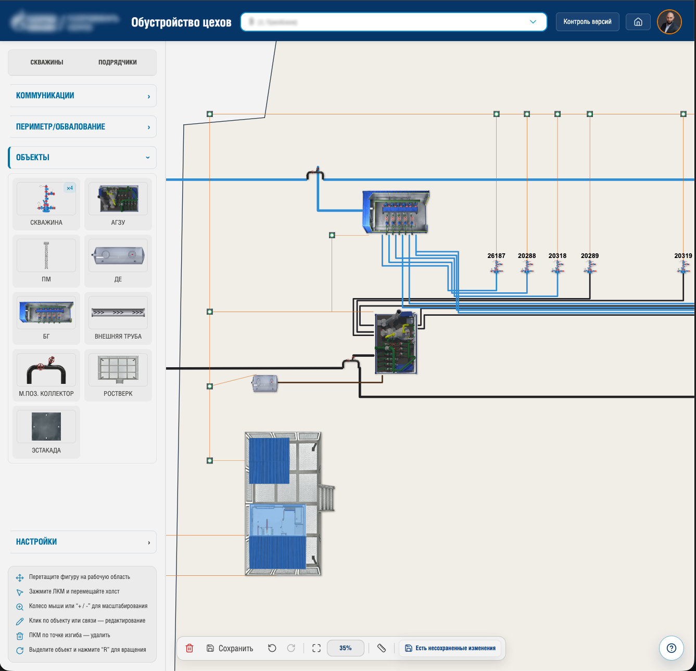

# Платформа цифровых решений

> Внутренняя платформенная монорепа для промышленных веб-приложений с общим UI, аутентификацией и переиспользуемыми модулями

---

<details open>
<summary>🇷🇺 Русский</summary>

### 🚀 Обзор

Платформа цифровых решений — это внутренняя система, предназначенная для унификации, масштабирования и ускорения разработки прикладных сервисов в производственных процессах.

Изначально система состояла из нескольких независимых приложений, но со временем была трансформирована в единую платформу с общими архитектурными и UI-принципами.

---

### 💡 Проблема

- дублирование UI и бизнес-логики между сервисами  
- разрозненная аутентификация и управление доступами  
- неоднородный пользовательский опыт  
- сложность поддержки и масштабирования  
- медленный запуск новых внутренних сервисов  

---

### ✅ Решение

Платформа на базе **monorepo**, объединяющая:

- единый Digital Services Hub (точка входа)  
- общую систему аутентификации и ролей  
- переиспользуемые UI-компоненты и layout  
- общую архитектурную основу для новых модулей  

---

### 🧩 Структура платформы

#### 1. Digital Services Hub

Центральная точка входа для пользователей:

- каталог приложений  
- управление доступами  
- единый профиль пользователя  
- общая навигация и layout  
- единый UX/UI  

---

#### 2. Сервис расчета раствора глушения

Инженерный сервис для автоматизации расчетов:

- автоматическая загрузка данных  
- расчеты вместо Excel  
- генерация отчетов  
- прозрачная логика формул  

---

#### 3. Сервис обустройства цехов

Визуальная система управления инфраструктурой:

- интерактивный canvas  
- управление объектами  
- визуализация схем  
- интеграция с корпоративными данными  
- история изменений  

---

### 🧩 Архитектура

```text
Пользователи
  ↓
Digital Services Hub
  ├── Аутентификация / роли
  ├── Дизайн-система
  ├── Layout / навигация
  └── Каталог сервисов
          ↓
   ┌───────────────────────────────┬───────────────────────────────┐
   │                               │                               │
Сервис глушения              Обустройство цехов              Новые модули
   │                               │
FastAPI + PostgreSQL         FastAPI + PostgreSQL
   │                               │
Корпоративные данные         Геоданные / OIS / ремонты
````

---

### ⚙️ Технологии

**Frontend:**
React, TypeScript, Vite, styled-components, Konva

**Backend:**
Python, FastAPI, SQLAlchemy, Pandas

**Данные:**
PostgreSQL

**Архитектура:**
Monorepo, общая дизайн-система, переиспользуемые компоненты, централизованная аутентификация

---

### Возможности платформы

* единый хаб внутренних сервисов
* ролевая модель доступа
* общий UI и дизайн-система
* быстрое подключение новых модулей
* снижение дублирования кода
* упрощение поддержки

---

### Результат

* переход от разрозненных сервисов к платформе
* снижение дублирования во frontend и backend
* унификация пользовательского опыта
* ускорение разработки новых сервисов
* создание базы для масштабирования

---

### Скриншоты

#### Hub

<p align="center">
  <a href="./assets/hub-main.png">
    
  </a>
  <a href="./assets/hub-access.png">
    
  </a>
</p>

---

#### Сервис глушения

<p align="center">
  <a href="./assets/jamsheet-main.png">
    
  </a>
  <a href="./assets/jamsheet-formula.png">
    
  </a>
</p>

---

#### Обустройство цехов

<p align="center">
  <a href="./assets/field-control-main.png">
    
  </a>
  <a href="./assets/field-control-objects.png">
    
  </a>
</p>

<p align="center">
  <sub>Нажми на изображение, чтобы открыть в полном размере</sub>
</p>

---

### Примечание

Проект представлен в обобщенном виде без раскрытия конфиденциального внутреннего содержимого.

</details>

---

<details>
<summary>🇬🇧 English</summary>

### 🚀 Overview

Digital Services Hub is an internal platform designed to unify and scale industrial web applications.

Initially developed as separate services, it evolved into a monorepo-based platform with shared architecture, UI system, and reusable components.

---

### 💡 Problem

* duplicated UI and business logic
* fragmented authentication and access control
* inconsistent user experience
* complex maintenance and scaling
* slow delivery of new internal tools

---

### ✅ Solution

A platform built on a **monorepo architecture** providing:

* centralized Digital Services Hub
* shared authentication and role system
* reusable UI components and layouts
* unified foundation for future modules

---

### 🧩 Platform Structure

#### 1. Digital Services Hub

* application catalog
* access management
* shared navigation and layout
* unified UX/UI

---

#### 2. Well Killing Calculation Service

* automated engineering calculations
* data integration
* report generation
* transparent calculation logic

---

#### 3. Field Infrastructure Control Service

* interactive canvas workspace
* object management
* infrastructure visualization
* integration with enterprise data
* change history

---

### 🧩 Architecture

```text
Users
  ↓
Digital Services Hub
  ├── Auth / roles
  ├── Design system
  ├── Layout / navigation
  └── App catalog
          ↓
   ┌───────────────────────────────┬───────────────────────────────┐
   │                               │                               │
Well Killing Service        Infrastructure Control        Future Modules
   │                               │
FastAPI + PostgreSQL         FastAPI + PostgreSQL
```

---

### ⚙️ Tech Stack

**Frontend:**
React, TypeScript, Vite, styled-components, Konva

**Backend:**
Python, FastAPI, SQLAlchemy, Pandas

**Database:**
PostgreSQL

**Architecture:**
Monorepo, shared UI system, reusable components, centralized authentication

---

### Impact

* transformation from separate tools to a unified platform
* reduced duplication across services
* improved UX consistency
* faster development of new modules
* scalable foundation for future products

---

### Screenshots

#### Hub

<p align="center">
  <a href="./assets/hub-main.png">
    
  </a>
  <a href="./assets/hub-access.png">
    
  </a>
</p>

---

#### Well Killing Service

<p align="center">
  <a href="./assets/jamsheet-main.png">
    
  </a>
  <a href="./assets/jamsheet-formula.png">
    
  </a>
</p>

---

#### Infrastructure Control

<p align="center">
  <a href="./assets/field-control-main.png">
    
  </a>
  <a href="./assets/field-control-objects.png">
    
  </a>
</p>

<p align="center">
  <sub>Click any image to open it in full size</sub>
</p>

---

### Notes

This project is presented in a generalized form without disclosing confidential internal content.

</details>
